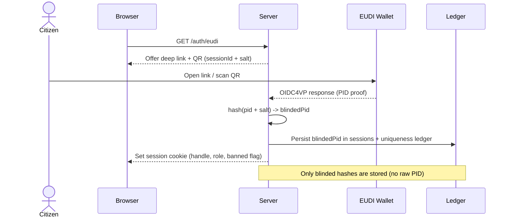
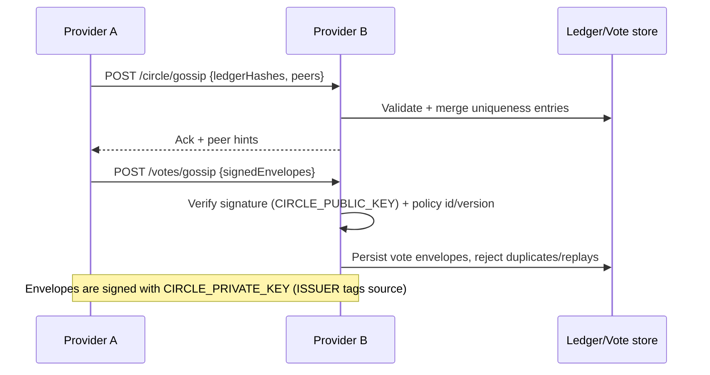

# Representative Party Framework

A Node.js implementation of the Representative Party "Party Circle" (or party/social ring) kernel. Phase 1 ships an SSR-first web app, QR-friendly OIDC4VP verifier scaffold, blinded Uniqueness Ledger, ActivityPub actor emission, petitions/votes/delegation scaffolds, and a discussion/forum surface tied to verified sessions.

## Quick install and run
- Prereqs: Node.js 20+ (ESM) and npm. `sqlite3` is bundled for the optional SQL adapter.
- Install dependencies: `npm install`
- Dev server (ephemeral): `DATA_ADAPTER=memory DATA_MODE=centralized npm start`
- Single-provider with persisted JSON: `npm start` (defaults to `http://0.0.0.0:3000`, stores under `src/data/`)
- Circle with signing/validation: `CIRCLE_PRIVATE_KEY=./priv.pem CIRCLE_PUBLIC_KEY=./pub.pem DATA_VALIDATION_LEVEL=strict npm start`
- Tests + adapter report: `npm test` and `npm run db:check`

## What this project solves
- One citizen = one voice via blinded PID hashes; no raw PII is stored.
- Soft-power accountability: auditable policy gates and traceable vote envelopes instead of imperative mandates.
- Liquid representation: topic-scoped delegation, revocable at any time, surfaced in UI and vote resolution.
- Federation resilience: peers gossip ledger/vote hashes and can quarantine toxic providers; ActivityPub actors expose public presence. Providers in the same social-party ring should prefer a shared or compatible client footprint so UX and enforcement stay aligned across the ring.
- Extensible policy: optional modules under `src/modules/extensions` can harden gates without forking the core.

## System map
- **Entry/server:** `src/index.js`, `src/app/server.js`, `src/app/router.js` (table-driven HTTP dispatch).
- **Interfaces (HTTP):** controllers in `src/interfaces/http/controllers/` (auth, discussion, forum, petitions, delegation, votes, groups, notifications, circle gossip, extensions, ActivityPub, static assets, admin, health, home); view helpers in `src/interfaces/http/views/`.
- **Domain modules:** `src/modules/` for identity/auth, circle policy, messaging/notifications, topics/classification, petitions/signatures, votes/envelopes, delegation, groups/elections, federation (ActivityPub), and extensions.
- **Infra:** persistence adapters + migrations in `src/infra/persistence/` (`adapters/json.js` default, `adapters/memory.js` for ephemeral) with replication helpers in `src/modules/federation/replication.js` and worker hooks reserved under `src/infra/workers/`.
- **Shared:** cross-cutting utilities in `src/shared/utils/`.
- **Views/assets:** SSR templates in `src/public/templates`, styles/JS in `src/public/`.
- **Extensions:** registry in `src/modules/extensions/registry.js` with sample `sample-policy-tighten.js`; enable via `CIRCLE_EXTENSIONS`.
- **Tests:** `npm test` runs the `node:test` suite in `tests/` (hashing, migrations, policy gates, classification, extensions).

## Common deployment recipes (settings + policy + extensions)
- Local messaging sandbox (no verification): `DATA_MODE=centralized DATA_ADAPTER=memory ENFORCE_CIRCLE=false` — exercise UI flows without writing to disk.
- Verified Circle, single provider: `DATA_MODE=centralized DATA_ADAPTER=json ENFORCE_CIRCLE=true CIRCLE_POLICY_ID=party-circle CIRCLE_PUBLIC_KEY=/path/pub.pem CIRCLE_PRIVATE_KEY=/path/priv.pem` — strict gates plus signed vote envelopes and ledger exports.
- Hardened policy via extension: add `CIRCLE_EXTENSIONS=sample-policy-tighten` (or a custom module under `src/modules/extensions/`) to layer org-specific checks without forking core code; toggles are also exposed in `/extensions` and `/admin`.
- Hybrid redundancy (canonical + gossip): `DATA_MODE=hybrid DATA_ADAPTER=sql DATA_SQLITE_FILE=./data/party.db DATA_VALIDATION_LEVEL=observe GOSSIP_INTERVAL_SECONDS=30` — keeps a SQL canonical store while ingesting gossip as preview data until validated.
- P2P-first ring: `DATA_MODE=p2p DATA_ADAPTER=kv DATA_KV_FILE=./data/ring.json DATA_VALIDATION_LEVEL=strict DATA_PREVIEW=false CIRCLE_PUBLIC_KEY=/path/pub.pem` — gossip-first sync, only accept signed/validated envelopes, and prefer deterministic replication.
- Topic/delegation experiments: `DATA_PREVIEW=true DATA_VALIDATION_LEVEL=observe` — allows preview entries from topic gardeners or classification helpers; UI marks previews and replication filters them when disabled.

## Identity + session flow (OIDC4VP scaffold)


## Federation, vote envelopes, and redundancy


## Capabilities by module
- **Auth & sessions:** `/auth/eudi` issues offers; `/auth/callback` finalizes through `src/modules/identity/*` (blinded PID hash + ActivityPub actor) and `src/interfaces/http/controllers/auth.js`. Pending sessions can be resumed with `?session={id}`.
- **Uniqueness Ledger + circle sync:** Ledger/sessions/peers persisted in `src/data/`; `/circle/gossip` ingests peer hashes, `/circle/ledger` exports, `/circle/peers` manages hints. Signing/verification lives in `src/modules/circle/federation.js`.
- **Policy gates:** Role-aware checks (citizen/moderator/delegate + banned flag) in `src/modules/circle/policy.js`; surfaced in `/health` and UI. Extensions can decorate/override decisions.
- **Discussion + forum:** `/discussion` and `/forum` controllers render SSR pages; posts/comments are persisted via `src/infra/persistence/storage.js`; topic classification hook runs per post via `src/modules/topics/classification.js`.
- **Petitions + votes:** `/petitions` draft/open/close petitions, signatures at `/petitions/sign`; `/petitions/vote` records one vote per citizen and emits a signed vote envelope (if signing keys set) from `src/modules/votes/voteEnvelope.js`; `/votes/ledger` exports, `/votes/gossip` ingests envelopes.
- **Delegation & groups:** `src/modules/delegation/delegation.js` stores per-topic delegates with auto-resolution; `/delegation/conflict` prompts when cachets clash. `src/modules/groups/*` publishes delegate preferences and runs elections; group policy (priority vs vote, conflict rules) is stored independently.
- **Topics & classification:** `src/modules/topics/classification.js` routes to extensions and the topic gardener helper (see `principle-docs/DynamicTopicCategorization.md`) to keep categories coherent, merge/split, and avoid conflicting provider labels. Configure anchors/pins + optional helper URL via `/admin`; a stub helper lives in `src/infra/workers/topic-gardener/server.py`.
- **Notifications:** `/notifications` lists unread; `/notifications/read` marks them; backing store handled by `src/modules/messaging/notifications.js`.
- **Admin & settings:** `/admin` toggles Circle policy, verification requirement, peers, extensions, default group policy, topic gardener, and session overrides without editing JSON.
- **ActivityPub stubs:** `/ap/actors/{hash}` exposes actor descriptors via `src/modules/federation/activitypub.js`; `/ap/inbox` placeholder for inbound federation payloads.

## Data management profiles, signing, and redundancy
- Storage adapters: defaults live under `src/data/` (`ledger.json`, `sessions.json`, `peers.json`, `discussions.json`, `petitions.json`, `signatures.json`, `votes.json`, `delegations.json`, `notifications.json`, `groups.json`, `group-policies.json`, `group-elections.json`, `actors.json`, `settings.json`, `meta.json`). `adapters/memory.js` is ephemeral; `adapters/sql.js` uses SQLite (`DATA_SQLITE_URL|FILE`, needs `sqlite3`); `adapters/kv.js` stores everything in a single KV JSON file. `src/infra/persistence/storage.js` routes through `src/infra/persistence/store.js` to pick the adapter.
- Centralized profile: `DATA_MODE=centralized` with any adapter; gossip is off, all writes go to the chosen store. Best for single-provider deployments and local dev. Back up `src/data/` (or the DB/KV file) regularly.
- Hybrid profile: `DATA_MODE=hybrid` keeps a canonical adapter (JSON/SQL/KV) while accepting gossip for redundancy/audit. Pair with `DATA_VALIDATION_LEVEL=observe|strict` to decide if gossip is stored as preview or rejected; `DATA_PREVIEW=true` allows staging until validated. Control pull frequency with `GOSSIP_INTERVAL_SECONDS`.
- P2P profile: `DATA_MODE=p2p` treats gossip as primary, with an optional local cache. Combine with `DATA_PREVIEW=false` and `DATA_VALIDATION_LEVEL=strict` to only accept signed, validated envelopes. Peers listed in `/circle/peers` seed synchronization; replication logic lives in `src/modules/federation/replication.js`.
- Signing & provenance: votes and ledger exports can be signed with `CIRCLE_PRIVATE_KEY` (PEM) and verified with `CIRCLE_PUBLIC_KEY`. Exports include policy id/version (`CIRCLE_POLICY_ID`, defaults in settings). Admin UI surfaces validation state; UI labels preview vs validated content when `DATA_PREVIEW` is enabled.
- Redundancy practice: snapshot data before migrations or adapter switches; publish `CIRCLE_PUBLIC_KEY` to peers before enabling signatures; treat peers as hints, not trust anchors—quarantine via Circle policy when validation fails. Worker-based topic gardeners live under `src/infra/workers/` and return preview entries gated by validation settings.
- Migrations: `src/infra/persistence/migrations.js` normalizes schema versions (handles/roles, petition lifecycle, delegation/notifications, extensions, group elections, data topology, validationStatus on content/groups/delegations/notifications). Metadata lives in `meta.json`; running `npm start` or `npm test` applies upgrades.

## Configuration
- Runtime: Node.js ESM app; `npm install`, `npm start` (defaults to `http://0.0.0.0:3000`).
- Environment flags:
  - `HOST`, `PORT`
  - `CIRCLE_POLICY_ID`, `ENFORCE_CIRCLE`, `GOSSIP_INTERVAL_SECONDS`
  - `CIRCLE_EXTENSIONS` (comma-separated module names under `src/modules/extensions`, e.g. `sample-policy-tighten`)
  - `CIRCLE_ISSUER` (provider id on envelopes/federation exports)
  - `CIRCLE_PRIVATE_KEY` / `CIRCLE_PUBLIC_KEY` (PEM) to sign/verify vote envelopes and ledger exports
  - `DATA_MODE` (`centralized` | `hybrid` | `p2p`), `DATA_ADAPTER` (`json`|`memory`|`sql`|`kv` — sql requires optional `sqlite3`), `DATA_VALIDATION_LEVEL` (`strict` | `observe` | `off`), `DATA_PREVIEW` (true/false for storing preview data before validation)
  - `DATA_SQLITE_URL`/`DATA_SQLITE_FILE` to set the SQLite path when using `DATA_ADAPTER=sql`; `DATA_KV_FILE` to set the KV file path
- Persisted settings (name, policy toggles, extensions, peers) live in `src/data/settings.json`; admin UI edits them in place.

## Development and testing
- Install & run:
  ```bash
  npm install
  npm test   # node:test: hashing, migrations, classification hooks, policy gates, extension registry
  npm start  # starts the SSR server
  npm run db:check  # prints adapter/profile + record counts for the current DATA_ADAPTER
  ```
- The app is SSR-first with a vanilla router interceptor: set `X-Requested-With: partial` to fetch partial HTML for app-like navigation.
- Static assets/templates live in `src/public`; keep new templates under `src/public/templates`.

## Operational notes
- Identity safety: only store blinded PID hashes; never persist wallet-provided PII. Keys used for envelope signing must be rotated carefully—publish `CIRCLE_PUBLIC_KEY` to peers before enabling signatures.
- Gossip: peers are hints, not trust anchors. Use Circle policy flags + `/health` to monitor enforcement and quarantine toxic providers.
- Data durability: JSON stores are append-heavy; schedule backups of `src/data/` and watch `meta.json` when migrations bump schema versions.
- Topic gardener: Python/ML helpers are expected to live under `src/infra/workers/` (see `principle-docs/DynamicTopicCategorization.md`); Node callers should reconcile provider outputs to avoid conflicting labels.

## Further reading
- `AI_REFERENCES.md` — implementation directives kept in sync with this README.
- `principle-docs/RepresentativeParties.md` — political thesis and design principles.
- `principle-docs/DynamicTopicCategorization.md` — topic gardener spec.
- `ROADMAP.md` — phased delivery plan (Party Circle kernel → deliberation → decision engine → federation hardening).
