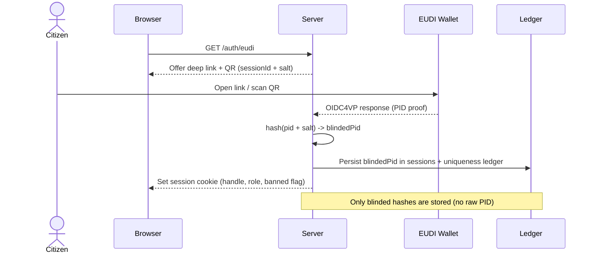
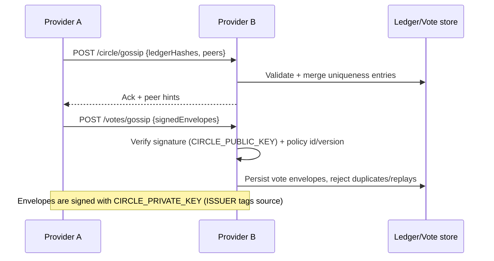

# Representative Party Framework

A Node.js implementation of the Representative Party "Party Circle" kernel. Phase 1 ships an SSR-first web app, QR-friendly OIDC4VP verifier scaffold, blinded Uniqueness Ledger, ActivityPub actor emission, petitions/votes/delegation scaffolds, and a discussion/forum surface tied to verified sessions.

## What this project solves
- One citizen = one voice via blinded PID hashes; no raw PII is stored.
- Soft-power accountability: auditable policy gates and traceable vote envelopes instead of imperative mandates.
- Liquid representation: topic-scoped delegation, revocable at any time, surfaced in UI and vote resolution.
- Federation resilience: peers gossip ledger/vote hashes and can quarantine toxic providers; ActivityPub actors expose public presence.
- Extensible policy: optional modules under `src/extensions` can harden gates without forking the core.

## System map
- **Entry/server:** `src/index.js`, `src/server/bootstrap.js`, `src/server/router.js`.
- **Routes:** `src/routes/` covers auth, discussion, forum, petitions, delegation, votes, groups, notifications, circle gossip, extensions, ActivityPub, static assets, admin, health, and home.
- **Services:** `src/services/` for auth (OIDC4VP scaffold + blinded PID), policy gates, classification hooks, delegation logic, group cachets/elections, notifications, activitypub actor factory, vote envelope signing/verification.
- **Persistence:** JSON-backed store via `src/state/storage.js` with migrations in `src/state/migrations.js`; files live under `src/data/`.
- **Views/assets:** SSR templates in `src/public/templates`, styles/JS in `src/public/`.
- **Extensions:** registry in `src/extensions/registry.js`; enable with `CIRCLE_EXTENSIONS`.
- **Tests:** `npm test` runs the `node:test` suite in `tests/` (hashing, migrations, policy gates, classification, extensions).

## Identity + session flow (OIDC4VP scaffold)


## Federation, vote envelopes, and redundancy


## Capabilities by module
- **Auth & sessions:** `/auth/eudi` issues offers; `/auth/callback` finalizes, writes blinded PID hash, mints an ActivityPub actor, sets the cookie. Pending sessions can be resumed with `?session={id}`.
- **Uniqueness Ledger + circle sync:** Ledger/sessions/peers persisted in `src/data/`; `/circle/gossip` ingests peer hashes, `/circle/ledger` exports, `/circle/peers` manages hints.
- **Policy gates:** Role-aware checks (citizen/moderator/delegate + banned flag) for posting, petitions, votes, moderation; surfaced in `/health` and UI. Extensions can decorate/override decisions.
- **Discussion + forum:** `/discussion` for threads tied to verified sessions; `/forum` for long-form articles with `/forum/comment` replies; topic classification hook runs per post.
- **Petitions + votes:** `/petitions` draft/open/close petitions, signatures at `/petitions/sign`; `/petitions/vote` records one vote per citizen and emits a signed vote envelope (if signing keys set); `/votes/ledger` exports, `/votes/gossip` ingests envelopes.
- **Delegation & groups:** `src/services/delegation.js` stores per-topic delegates with auto-resolution; `/delegation/conflict` prompts when cachets clash. Groups (`/groups`) publish delegate preferences and run elections; group policy (priority vs vote, conflict rules) is stored independently.
- **Topics & classification:** `src/services/classification.js` routes to extensions and the future topic gardener (see `principle-docs/DynamicTopicCategorization.md`) to keep categories coherent, merge/split, and avoid conflicting provider labels.
- **Notifications:** `/notifications` lists unread; `/notifications/read` marks them; backing store in `src/data/notifications.json`.
- **Admin & settings:** `/admin` toggles Circle policy, verification requirement, peers, extensions, default group policy, and session overrides without editing JSON.
- **ActivityPub stubs:** `/ap/actors/{hash}` exposes actor descriptors; `/ap/inbox` placeholder for inbound federation payloads.

## Persistence and migrations
- JSON stores under `src/data/` (`ledger.json`, `sessions.json`, `peers.json`, `discussions.json`, `petitions.json`, `signatures.json`, `votes.json`, `delegations.json`, `notifications.json`, `groups.json`, `group-policies.json`, `group-elections.json`, `actors.json`, `settings.json`, `meta.json`).
- `src/state/migrations.js` normalizes schema versions (adds handles/roles, petition lifecycle, delegation/notifications, extension list). Metadata lives in `meta.json`.
- Pluggable store abstraction keeps a path to DB adapters while preserving current data; back up `src/data/` before upgrades.

## Configuration
- Runtime: Node.js ESM app; `npm install`, `npm start` (defaults to `http://0.0.0.0:3000`).
- Environment flags:
  - `HOST`, `PORT`
  - `CIRCLE_POLICY_ID`, `ENFORCE_CIRCLE`, `GOSSIP_INTERVAL_SECONDS`
  - `CIRCLE_EXTENSIONS` (comma-separated module names under `src/extensions`, e.g. `sample-policy-tighten`)
  - `CIRCLE_ISSUER` (provider id on envelopes/federation exports)
  - `CIRCLE_PRIVATE_KEY` / `CIRCLE_PUBLIC_KEY` (PEM) to sign/verify vote envelopes and ledger exports
- Persisted settings (name, policy toggles, extensions, peers) live in `src/data/settings.json`; admin UI edits them in place.

## Development and testing
- Install & run:
  ```bash
  npm install
  npm test   # node:test: hashing, migrations, classification hooks, policy gates, extension registry
  npm start  # starts the SSR server
  ```
- The app is SSR-first with a vanilla router interceptor: set `X-Requested-With: partial` to fetch partial HTML for app-like navigation.
- Static assets/templates live in `src/public`; keep new templates under `src/public/templates`.

## Operational notes
- Identity safety: only store blinded PID hashes; never persist wallet-provided PII. Keys used for envelope signing must be rotated carefully—publish `CIRCLE_PUBLIC_KEY` to peers before enabling signatures.
- Gossip: peers are hints, not trust anchors. Use Circle policy flags + `/health` to monitor enforcement and quarantine toxic providers.
- Data durability: JSON stores are append-heavy; schedule backups of `src/data/` and watch `meta.json` when migrations bump schema versions.
- Topic gardener: Python/ML helpers are expected to live under `helpers/` (see `principle-docs/DynamicTopicCategorization.md`); Node callers should reconcile provider outputs to avoid conflicting labels.

## Further reading
- `AI_REFERENCES.md` — implementation directives kept in sync with this README.
- `principle-docs/RepresentativeParties.md` — political thesis and design principles.
- `principle-docs/DynamicTopicCategorization.md` — topic gardener spec.
- `ROADMAP.md` — phased delivery plan (Party Circle kernel → deliberation → decision engine → federation hardening).
