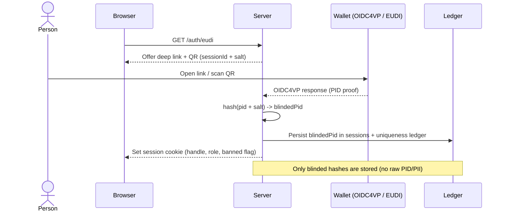
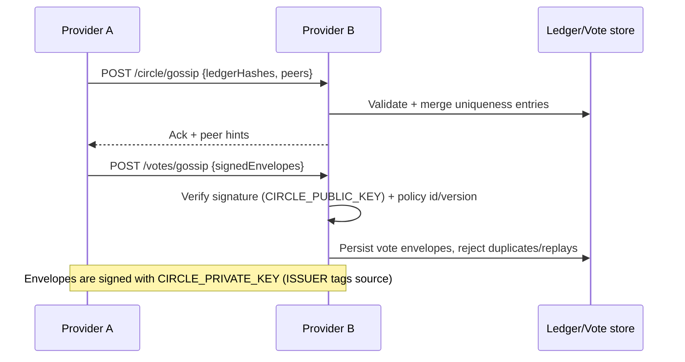

# Representative Party Web Framework

A **messaging‑first “Party Circle” kernel** for civic and political organizations that want deliberation and representation *without* turning identity into a surveillance problem.

This repository is a Node.js SSR application that starts as a usable discussion + notification network, then lets you progressively enable higher‑stakes modules (petitions, votes, delegation, federation) as your policy and governance mature. The identity layer is designed around **blinded uniqueness**: the server can enforce **one natural person = one voice** **without storing raw PII**.

> **Status / intent**
> Practical scaffold for pilots, internal deployments, and research‑grade iteration. Some protocols (OIDC4VP, ActivityPub, federation hardening) are present as scaffolding and will evolve — see `ROADMAP.md`.

---

## Why this exists

Most “civic platforms” fail in one of two ways:

1. **They ship “voting” before shipping “conversation.”** People need a place to learn, argue, and revise ideas before any decision has legitimacy.
2. **They bind trust to centralized identity.** That creates pressure to collect personal data, which becomes a liability and a power imbalance.

This project takes the opposite stance:

- Start with **messaging and accountability cues**.
- Add **formal decision tools** only when you can defend them socially and operationally.
- Keep identity **privacy‑first** by storing only **blinded hashes** (not names, not documents).

---

## Who it’s for

- Parties, civic committees, associations, unions, NGOs, and community groups
- Researchers prototyping representation models (liquid delegation, topic‑scoped voting, federation)
- Teams that need a *deployable* baseline today, not a perfect protocol paper

---

## Vocabulary

- **user**: the default actor in general deployments.
- **person**: a Circle label for a **verified natural person** (civic/party mode).

When civic mode is enabled, the *exclusion principle* applies: **org/bot/service accounts cannot hold handles or act**.

The code keeps this distinction explicit so deployments can start lightweight and become stricter later without rewiring the UX. UI copy follows the same rule: “person” labels appear only when Circle enforcement is strict; otherwise the UI uses “user”.

---

## Highlights

- **Messaging‑first kernel**: discussion + forum + notifications work alone.
- **Natural‑person exclusion principle (optional)**: a Circle can require verified natural persons (no org/bot/service accounts holding handles).
- **Blinded uniqueness ledger**: prevent duplicate participation without retaining raw PID/PII.
- **Petitions → votes pipeline**: proposals, collaborative revisions + version history, revision diffs + pre‑vote freeze, signatures/quorum, deliberation feed, vote envelopes (signable).
- **Topic gardener review**: admin confirms rename/merge/split plus anchor promotion/archival suggestions with history diff previews.
- **Audit trails**: append‑only transactions for discussions, petitions (signatures/comments), social, group actions, and outbound deliveries with exportable summaries.
- **Identity throttles**: per‑handle/session rate limiting (IP fallback) to curb spam without CAPTCHA.
- **Liquid representation**: topic‑scoped delegation with revocable overrides.
- **Federation scaffolding + redundancy knobs**: gossip endpoints, signed envelopes, and ActivityPub inbox ingestion (preview‑gated) for auditability.
- **Peer ledger audits**: peer health tracks last ledger hash snapshots (match/mismatch) in `/admin` and `/health`.
- **Storage‑agnostic**: pluggable persistence adapters and `DATA_MODE` profiles.
- **Profile attributes**: schema‑driven provider‑local fields with a per‑session editor, schema versioning, inline validation, and stale‑schema warnings; never gossiped.
- **Extensions**: tighten policy without forking (`src/modules/extensions/`, `CIRCLE_EXTENSIONS`).

---

## What you can do with it

### 1) Run a discussion network now
- Handles, roles, moderation flags, notifications
- SSR pages + partial‑HTML navigation (fast, indexable, minimal JS)

### 2) Add civic “Circle” guarantees when ready
- OIDC4VP verification scaffold (EUDI wallet flow)
- Store only **blinded** identity hashes for uniqueness + session roles

### 3) Turn on proposals, votes, delegation, federation incrementally
- Petitions, collaborative drafts, and signatures (quorum gates)
- Signed vote envelopes and exports
- Topic‑scoped delegation and group‑level recommendations
- Peer gossip endpoints and quarantine hooks (stubbed)

---

## Quick start

**Prereqs:** Node.js 20+ (ESM) and npm. `sqlite3` is bundled for the optional SQL adapter.

Copy `.env.example` to `.env` for the full list of available configuration variables. The server loads `.env` automatically at startup.

```bash
npm install

# Ephemeral dev (in‑memory)
DATA_ADAPTER=memory DATA_MODE=centralized npm start

# Persisted JSON (default)
npm start

# Standalone full-feature dev (admin/admin bootstrap)
./run-standalone.sh
```

The standalone script seeds a local KV store, generates signing keys if missing, and prints a one-click admin login link (user: `admin`, password: `admin`).

### Common recipes

```bash
# Messaging UI without Circle enforcement
DATA_MODE=centralized DATA_ADAPTER=memory ENFORCE_CIRCLE=false npm start

# Verified Circle with strict validation + signing
CIRCLE_PRIVATE_KEY=./priv.pem CIRCLE_PUBLIC_KEY=./pub.pem   DATA_VALIDATION_LEVEL=strict ENFORCE_CIRCLE=true npm start
```

```bash
# Tests + adapter report
npm test
npm run test:ui   # UI-only suite (Puppeteer)
npm run db:check
```

### Testing notes

- `npm test` runs the full `node:test` suite (including Puppeteer UI flows and P2P ring smoke tests) and spins up local servers on ad hoc ports with temp data files.
- `npm run test:ui` runs the UI‑only Puppeteer flow for a stable CI entry point.
- If headless Chrome fails in CI, set up the system dependencies or skip the UI suite.

### Defaults

- Server: `http://0.0.0.0:3000`
- JSON persistence (default): writes under `src/data/`

### Useful endpoints

- `/` landing, `/health` metrics
- `/auth/eudi` start verification, `/auth/callback` return
- `/discussion`, `/forum`, `/notifications`, `/delegation`
- `/profile` (provider‑local profile attributes editor)
- `/petitions` and `/petitions/*` (when enabled), `/votes/*` (when enabled)
- `/social/*` micro‑posts, follows, and media uploads (`/social/media/{id}`, `/social/media/report`)
- `/admin` settings, policy toggles, rate‑limit overrides, and audit summaries; `/extensions` extension toggles
- `/transactions`, `/transactions/export`, `/transactions/ledger`, `/transactions/gossip` for local audit + cross‑provider reconciliation
- `/circle/*` gossip/ledger/peers (federation scaffolding), `/ap/*` ActivityPub endpoints (`/ap/actors/{hash}`, `/ap/actors/{hash}/outbox`, `/ap/outbox`, `/ap/objects/{id}`, `/ap/inbox` ingesting preview social notes for local recipients)

---

## Core ideas

- **One person = one voice** via blinded PID hashes and policy gates.
- **Soft‑power accountability**: auditable policy decisions and signed vote envelopes instead of imperative mandates.
- **Liquid representation**: topic‑scoped delegation with revocable overrides.
- **Personalizable structure manager**: canonical profile fields (handle + credential/wallet binding, role/banned flag, blinded identity) are fixed across a party ring; provider‑local optional fields (contact email, personal details, notification preferences) live in a versioned schema/data‑table editor with a per‑session profile page and never gossip.
- **Messaging‑first adoption**: discussion and notifications work alone; petitions/votes/delegation/federation are opt‑in.
- **Federation resilience**: peers gossip ledger/vote hashes, reject policy id/version mismatches, and can quarantine toxic providers (peer health visible in `/admin`); ActivityPub actors expose public presence.
- **Human‑ready maintenance**: small modules, plain SSR templates, env‑driven knobs, documented flows.

---

## Modules at a glance

### Always‑on value (messaging kernel)
- **Discussion + forum**: threaded posts/comments with SSR UI.
- **Notifications**: internal read/unread registry and preferences.
- **Profile attributes**: schema‑driven provider‑local fields with self‑service editing under `/profile`, schema versioning, and inline validation.
- **Social feed**: micro‑post lane with typed follows (circle/interest/info/alerts) kept separate from petitions/votes.

### Optional governance tools
- **Petitions**: draft proposals, collaborative revisions with history + diffs, signatures/quorum, stage transitions, pre‑vote freeze, discussion feed.
- **Votes**: one vote per person when enabled; exports + envelope signing/verification when keys are configured.
- **Delegation**: topic‑scoped delegation with conflict resolution UI.
- **Groups/elections**: group‑level delegate preferences and elections (advisory by design, with optional conflict prompts); in `electionMode=vote`, recommendations prefer the latest closed election winner.
- **Topics & gardener**: dynamic topic labeling with admin review (rename/merge/split + anchor promotion/archival suggestions).

### Circle & federation scaffolding
- **Uniqueness ledger + gossip**: exchange ledger hashes and peer hints.
- **ActivityPub scaffolding**: actors + outbox plus inbox ingestion that stores inbound notes as preview entries when allowed.

---

## How identity works (OIDC4VP scaffold)

The verifier flow is designed to be **privacy‑preserving**: the server stores only a blinded hash derived from the wallet‑presented identifier plus a server salt.



> **Important:** this repo provides the *verification scaffold and policy hooks*. Compliance and production hardening depend on your deployment’s legal and security context — treat the identity layer as a component you audit and evolve.

---

## Federation, vote envelopes, and redundancy



---

## Data modes, adapters, and preview/validation

The persistence layer is intentionally storage‑agnostic.

### Adapters
- `json` (default)
- `memory` (ephemeral)
- `sql` (SQLite)
- `kv` (single‑file KV JSON)

### Modes
- `DATA_MODE=centralized`: single provider store, no gossip writes/ingest
- `DATA_MODE=hybrid`: canonical store + gossip as redundancy/audit
- `DATA_MODE=p2p`: gossip‑ledger primary, optional local cache

### Preview & validation gates

Two switches gate uncertified data:

- `DATA_VALIDATION_LEVEL` (`strict|observe|off`)
- `DATA_PREVIEW` (`true|false`) to store and/or render preview entries

This allows deployments to experiment with helpers (topic gardeners, classification) and federation inputs *without silently treating them as authoritative*.

Ledger exports (`/votes/ledger`, `/transactions/ledger`) respect the same preview gating and omit preview entries when `DATA_PREVIEW=false`.

---

## Configuration

### Core knobs (env)

- Server: `HOST`, `PORT`
- Circle/policy: `ENFORCE_CIRCLE`, `CIRCLE_POLICY_ID`, `CIRCLE_ISSUER`, `GOSSIP_INTERVAL_SECONDS` (issuer labels gossip envelopes; `/admin` can override it in settings)
- Topic gardener: `TOPIC_GARDENER_SYNC_SECONDS` (poll `/operations` for rename/merge/split suggestions)
- Extensions: `CIRCLE_EXTENSIONS` (comma‑separated module names under `src/modules/extensions/`)
- Signing: `CIRCLE_PRIVATE_KEY`, `CIRCLE_PUBLIC_KEY` (PEM)
- Outbound delivery: `OUTBOUND_EMAIL_WEBHOOK`, `OUTBOUND_SMS_WEBHOOK`, `OUTBOUND_WEBHOOK_HEADERS`, `OUTBOUND_TRANSPORT_MODULE`
- Persistence:
  - `DATA_MODE` (`centralized|hybrid|p2p`)
  - `DATA_ADAPTER` (`json|memory|sql|kv`)
  - `DATA_VALIDATION_LEVEL` (`strict|observe|off`)
  - `DATA_PREVIEW` (`true|false`)
  - SQL: `DATA_SQLITE_URL` / `DATA_SQLITE_FILE`
  - KV: `DATA_KV_FILE`
- Rate limits: per‑action overrides via `/admin` (stored in `settings.rateLimits`)
- Social/media: `SOCIAL_MEDIA_MAX_BYTES` (default 10MB), `SOCIAL_MEDIA_REPORT_THRESHOLD` (default 3)

Provider settings are persisted in `src/data/settings.json` and can be edited via `/admin`.

### Common deployment recipes (settings + policy + extensions)

- **Local messaging sandbox (no verification)**  
  `DATA_MODE=centralized DATA_ADAPTER=memory ENFORCE_CIRCLE=false` — exercise UI flows without writing to disk.
- **Verified Circle, single provider**  
  `DATA_MODE=centralized DATA_ADAPTER=json ENFORCE_CIRCLE=true CIRCLE_POLICY_ID=party-circle CIRCLE_PUBLIC_KEY=/path/pub.pem CIRCLE_PRIVATE_KEY=/path/priv.pem` — strict gates + signed vote envelopes and ledger exports.
- **Hardened policy via extension**  
  Add `CIRCLE_EXTENSIONS=sample-policy-tighten` (or a custom module under `src/modules/extensions/`) to layer org‑specific checks without forking core code; toggles are also exposed in `/extensions` and `/admin`.
- **Hybrid redundancy (canonical + gossip)**  
  `DATA_MODE=hybrid DATA_ADAPTER=sql DATA_SQLITE_FILE=./data/party.db DATA_VALIDATION_LEVEL=observe GOSSIP_INTERVAL_SECONDS=30` — keep a SQL canonical store while ingesting gossip as preview data until validated.
- **P2P‑first ring**  
  `DATA_MODE=p2p DATA_ADAPTER=kv DATA_KV_FILE=./data/ring.json DATA_VALIDATION_LEVEL=strict DATA_PREVIEW=false CIRCLE_PUBLIC_KEY=/path/pub.pem` — gossip‑first sync and only accept signed/validated envelopes.
- **Topic/delegation experiments**  
  `DATA_PREVIEW=true DATA_VALIDATION_LEVEL=observe` — allow preview entries from topic gardeners or classification helpers; UI marks previews and replication filters them when disabled.

---

## Project map

### Entry / server
- `src/index.js`, `src/app/server.js`, `src/app/router.js`

### Interfaces (HTTP)
- Controllers: `src/interfaces/http/controllers/`
- View helpers: `src/interfaces/http/views/`

### Domain modules
- `src/modules/` for identity/auth, circle policy, messaging/notifications, social feed/follows, topics/classification, petitions/signatures, votes/envelopes, delegation, groups/elections, federation (ActivityPub + gossip sync helpers), and extensions.

### Infra / persistence
- Adapters + migrations: `src/infra/persistence/`
- Replication helpers: `src/modules/federation/replication.js`
- Worker hooks reserved under: `src/infra/workers/`
- Shared utilities: `src/shared/utils/`

### Views / assets
- SSR templates: `src/public/templates/`
- Styles/JS: `src/public/app.css`, `src/public/app.js`

### Extensions
- Registry: `src/modules/extensions/registry.js`
- Sample: `sample-policy-tighten.js` (enable via `CIRCLE_EXTENSIONS`)

### Tests
- `npm test` runs the `node:test` suite in `tests/` (hashing, migrations, policy gates, classification, extensions, Puppeteer UI flows, ring gossip).
- `npm run test:ui` runs the UI‑only flow.

---

## Capabilities by module (endpoints + internals)

- **Auth & sessions:** `/auth/eudi` issues offers; `/auth/callback` finalizes through `src/modules/identity/*` (blinded PID hash + ActivityPub actor) and `src/interfaces/http/controllers/auth.js`. Pending sessions can be resumed with `?session={id}`.
- **Uniqueness Ledger + circle sync:** ledger/sessions/peers persisted in `src/data/`; `/circle/gossip` ingests peer hashes, `/circle/ledger` exports, `/circle/peers` manages hints. Signing/verification lives in `src/modules/circle/federation.js`.
- **Policy gates:** role-aware checks (person/moderator/delegate + banned flag) in `src/modules/circle/policy.js`; surfaced in `/health` and UI. Extensions can decorate/override decisions.
- **Discussion + forum:** `/discussion` and `/forum` controllers render SSR pages; posts/comments are persisted via `src/infra/persistence/storage.js`; topic classification hook runs per post via `src/modules/topics/classification.js`.
- **Social feed & follows:** `/social/*` handles short posts + replies + reshares driven by typed follows (circle/interest/info/alerts), plus optional photo/video uploads. Media stays provider-local, locks by default until viewers request access, and can be blocked after mass reports or manual review. Follow edges and micro-posts persist through `src/infra/persistence/storage.js`; the feed filter surfaces per-type counts so users can see coverage at a glance, and UX keeps this lane scoped to small talk/info so petitions/votes remain distinct.
- **Petitions + votes:** `/petitions` drafts proposals with summary + optional full text; `/petitions/update` records collaborative revisions and version history; quorum moves proposals into discussion (or straight to vote when configured), and `/petitions/status` advances them to vote/closed. Signatures at `/petitions/sign`, discussion notes at `/petitions/comment`, and `/petitions/vote` records one vote per person and emits a signed vote envelope (if signing keys set) from `src/modules/votes/voteEnvelope.js`; `/votes/ledger` exports, `/votes/gossip` ingests envelopes. The proposals page includes a discussion feed and stage filter with per-proposal anchors to jump between feed items and the list.
- **Delegation & groups:** `src/modules/delegation/delegation.js` stores per-topic delegates with auto-resolution; `/delegation` manages manual preferences and `/delegation/conflict` prompts when cachets clash. `src/modules/groups/*` publishes delegate preferences and runs elections with optional second/third-choice ballots and multi-round transfers; group policy (priority vs vote, conflict rules) is stored independently, vote-mode recommendations prefer the latest closed election winner, and the delegation UI surfaces election-winner metadata.
- **Groups UI**: closed elections surface the winner, method, and round count directly in the group panel, and closing an election auto-updates the delegate cachet for that topic.
- **Topics & classification:** `src/modules/topics/classification.js` routes to extensions and the topic gardener helper (see `principle-docs/DynamicTopicCategorization.md`) to keep categories coherent, merge/split, and avoid conflicting provider labels. A topic registry persists ids/path metadata so SSR views can render breadcrumbs. Configure anchors/pins + optional helper URL via `/admin`; the helper runs from `src/infra/workers/topic-gardener/server.py` with scheduled refactor operations, and `/admin` surfaces pending rename/merge/split suggestions plus topic history diffs for review.
- **Notifications:** `/notifications` lists unread; `/notifications/read` marks them; `/notifications/preferences` stores per-user proposal comment alert preferences; backing store handled by `src/modules/messaging/notifications.js`.
- **Admin & settings:** `/admin` toggles Circle policy, verification requirement, issuer (public URL for gossip envelopes), peers, extensions, core modules (petitions/votes/delegation/groups/federation/topic gardener/social), default group policy, topic gardener, gossip sync controls, media moderation (reports + view requests), and session overrides without editing JSON. Topic gardener review includes preview panels with confirmation for merge/split, pending rename/merge/split suggestions, a topic history diff view, and a manual sync button. Gossip push/pull controls disable when federation is off or data mode is centralized.
- **ActivityPub stubs:** `/ap/actors/{hash}` exposes actor descriptors and `/ap/actors/{hash}/outbox` serves per-actor posts via `src/modules/federation/activitypub.js`; `/ap/outbox` serves a global collection; `/ap/objects/{id}` serves local note objects; `/ap/inbox` ingests preview social notes (ignores direct payloads not addressed to a local actor) and triggers mention/direct notifications. ActivityPub endpoints require federation + social modules to be enabled.
- **Transactions registry:** `/transactions` lists local, stamped entries for sensitive actions (petition drafts/status changes, votes, delegation overrides); `/transactions/export` emits a signed digest envelope, `/transactions/ledger` serves the envelope to peers, and `/transactions/gossip` ingests summaries for cross-provider reconciliation.

## UI & templating (extension‑aware)

- SSR‑first shell lives in `src/public/templates/` with `layout.html` wrapping page templates; status strip surfaces Circle enforcement + validation/preview state so users see why content is gated. Styles/JS in `src/public/app.css` and `src/public/app.js`.
- Navigation and panels stay modular: keep links visible only for enabled modules (discussion/forum/social/petitions/delegation/groups) to avoid dead ends; module toggles live in `/admin` and extension toggles (`/extensions` or `CIRCLE_EXTENSIONS`) drive policy badges and gate messages.
- Preview/provenance cues are consistent across modules (pills for `Preview` and `from {issuer}`); when `DATA_PREVIEW=false`, the server hides previews, otherwise label them. Social feed shows follow‑type filters + inline replies; discussion/forum reuse the same pill language.
- Templating personalization: duplicate templates under `src/public/templates/` to theme per deployment (colors/fonts can be tweaked in `app.css`); keep SSR placeholders (`{{...}}`) intact for router partial responses. Avoid SPA‑only components to preserve partial‑render navigation.
- Extension UI hooks: use light‑touch badges or info strips to signal tightened policies (extension‑driven gate changes) instead of new flows; policy messages come from `circle/policy` so custom extensions display automatically. Notifications and social mentions reuse the same renderer to keep UX coherent across modules.

---

## Data management profiles, signing, and redundancy

### Storage layout (default JSON adapter)

Defaults live under `src/data/`:

- `ledger.json`, `sessions.json`, `peers.json`
- `discussions.json`, `petitions.json`, `signatures.json`, `votes.json`, `delegations.json`, `notifications.json`
- `topics.json`, `groups.json`, `group-policies.json`, `group-elections.json`
- `actors.json`
- `social-follows.json`, `social-posts.json`, `social-media.json`
- `transactions.json`, `transaction-summaries.json`
- `settings.json`, `meta.json`

Media binaries live under `src/data/media/` and are served through provider‑gated endpoints.

Adapter notes:
- `adapters/memory.js` is ephemeral.
- `adapters/sql.js` uses SQLite (`DATA_SQLITE_URL|FILE`, needs `sqlite3`).
- `adapters/kv.js` stores everything in a single KV JSON file.
- `src/infra/persistence/storage.js` routes through `src/infra/persistence/store.js` to pick the adapter.

### Data management priorities

- Provider‑local contact fields stay local (no gossip).
- Previews are gated by `DATA_PREVIEW` + validation level.
- Redundancy is chosen via `DATA_MODE` (centralized/hybrid/p2p) and adapter.
- Signatures/validation state decide what can be rendered or replicated.

### Transactions (audit)

- **Main transactions registry**: append‑only log (type, petitionId, actorHash, digest) stored locally in `transactions.json` (or adapter equivalent) for sensitive operations (e.g., petition drafts, votes). Entries are stamped with issuer/mode/adapter and validation status; `/transactions` exposes recent entries for audit, `/health` surfaces counts/digests plus summary gossip totals.
- **Transactions summary gossip**: `/transactions/export` emits a summary envelope (issuer/mode/adapter, digests) signed when `CIRCLE_PRIVATE_KEY` is set; `/transactions/ledger` serves the envelope to peers and `/transactions/gossip` ingests summary envelopes into `transaction-summaries.json` for reconciliation. Use gossip carefully with strict validation.

### Profiles

- **Centralized profile**: `DATA_MODE=centralized` with any adapter; gossip is off (no ingest), all writes go to the chosen store. Best for single‑provider deployments and local dev. Back up `src/data/` (or the DB/KV file) regularly.
- **Hybrid profile**: `DATA_MODE=hybrid` keeps a canonical adapter (JSON/SQL/KV) while accepting gossip for redundancy/audit. Pair with `DATA_VALIDATION_LEVEL=observe|strict` to decide if gossip is stored as preview or rejected; `DATA_PREVIEW=true` allows staging until validated. Control push/pull frequency with `GOSSIP_INTERVAL_SECONDS`.
- **P2P profile**: `DATA_MODE=p2p` treats gossip as primary, with an optional local cache. Combine with `DATA_PREVIEW=false` and `DATA_VALIDATION_LEVEL=strict` to only accept signed, validated envelopes. Peers listed in `/circle/peers` seed synchronization; replication logic lives in `src/modules/federation/replication.js`.

### Signing & provenance

- Votes and ledger exports can be signed with `CIRCLE_PRIVATE_KEY` (PEM) and verified with `CIRCLE_PUBLIC_KEY`.
- Exports include policy id/version (`CIRCLE_POLICY_ID`, defaults in settings).
- Admin UI surfaces validation state; UI labels preview vs validated content when `DATA_PREVIEW` is enabled.

### Redundancy practice

- Snapshot data before migrations or adapter switches.
- Publish `CIRCLE_PUBLIC_KEY` to peers before enabling signatures.
- Treat peers as hints, not trust anchors.
- Worker‑based topic gardeners live under `src/infra/workers/` and return preview entries gated by validation settings.

### Migrations

- `src/infra/persistence/migrations.js` normalizes schema versions (handles/roles, petition lifecycle, delegation/notifications, extensions, group elections, data topology, validationStatus on content/groups/delegations/notifications).
- Metadata lives in `meta.json`; running `npm start` or `npm test` applies upgrades.

---

## Development and testing

```bash
npm install
npm test         # node:test: hashing, migrations, classification hooks, policy gates, extensions, UI + ring tests
npm run test:ui  # Puppeteer UI-only flow
npm start        # starts the SSR server
npm run db:check # prints adapter/profile + record counts for the current DATA_ADAPTER
```

- The app is SSR‑first with a vanilla router interceptor: set `X-Requested-With: partial` to fetch partial HTML for app‑like navigation.
- Static assets/templates live in `src/public`; keep new templates under `src/public/templates`.

---

## Operational notes (privacy, safety, backups)

- **No raw PID/PII**: persist only blinded hashes. Treat any provider‑local optional fields (email, personal details) as *local only* and never gossip them.
- **Peers are hints, not trust anchors**: federation tooling should assume peers can be wrong or malicious; strict validation and quarantine are part of the intended hardening path.
- **Audit visibility**: `/admin` surfaces ledger hash, gossip ingest state, outbound/inbound gossip sync status, peer health reset actions, and recent transactions; `/transactions`, `/transactions/export`, `/transactions/ledger`, and `/transactions/gossip` provide JSON and signed summaries for reconciliation. `/health` exposes peer health summaries plus vote/transactions gossip added/updated counts for ops dashboards, including last peer ledger hash snapshots (match/mismatch). Gossip sync skips peers that disable modules or gossip, so peer health reflects real failures.
- **Gossip resilience**: optional endpoints (votes/transactions) that are missing or disabled are treated as skipped for peer health scoring, so messaging-only peers do not get penalized.
- **Backups**: if you run with JSON/KV storage, schedule backups of `src/data/` (or your DB/KV file), especially before migrations.

---
- Identity safety: only store blinded PID hashes; never persist wallet-provided PII. Keys used for envelope signing must be rotated carefully; publish `CIRCLE_PUBLIC_KEY` to peers before enabling signatures.
- Gossip: peers are hints, not trust anchors. Use Circle policy flags + `/health` to monitor enforcement and quarantine toxic providers.
- Data durability: JSON stores are append-heavy; schedule backups of `src/data/` and watch `meta.json` when migrations bump schema versions.
- Topic gardener: Python/ML helpers are expected to live under `src/infra/workers/` (see `principle-docs/DynamicTopicCategorization.md`); Node callers should reconcile provider outputs to avoid conflicting labels.

## Further reading

- `ROADMAP.md` — phased delivery plan and sequencing rationale
- `AGENTS.md` — implementation directives and vocabulary contract
- `principle-docs/RepresentativeParties.md` — design principles and thesis
- `principle-docs/DynamicTopicCategorization.md` — topic gardener spec

---

## Contributing

If you want to contribute, start by reading `AGENTS.md` and keep changes aligned with the vocabulary and privacy constraints. Small, testable modules are preferred over deep rewrites.
